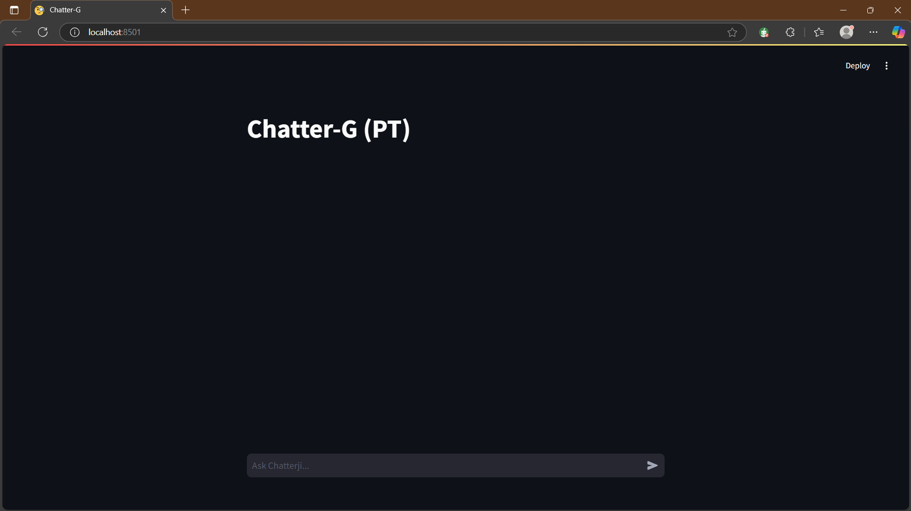
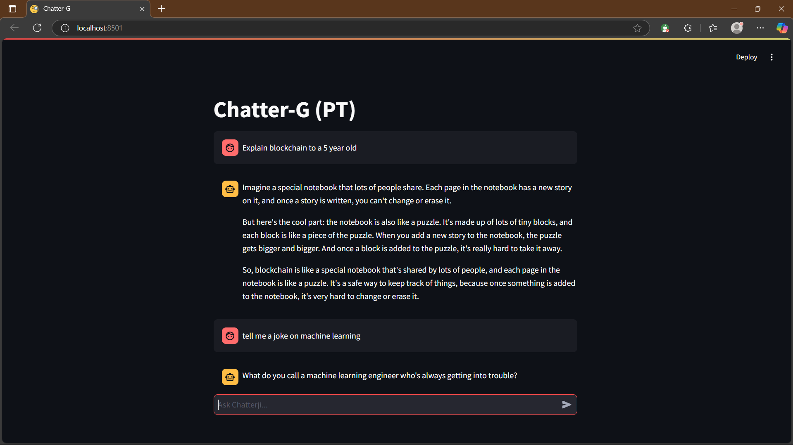
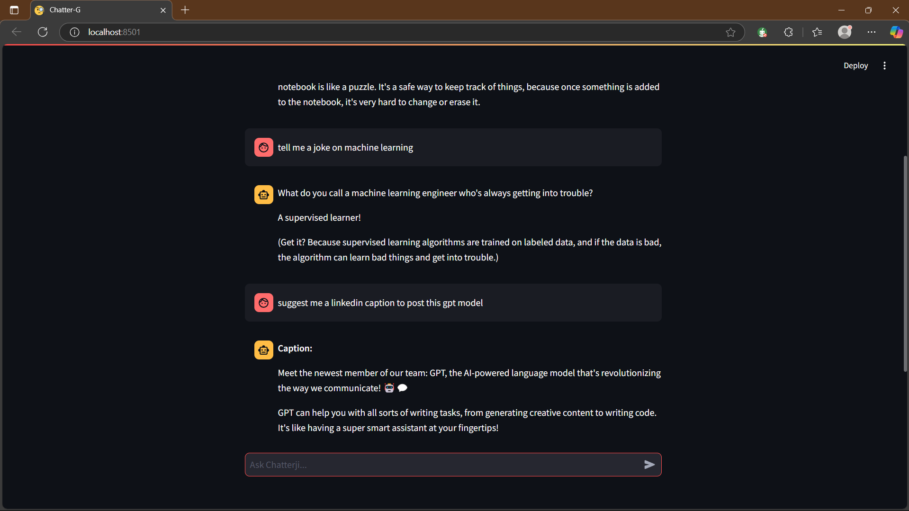

# Chatter-G (PT)

This repository contains a **GPT Model** built using **Streamlit** and powered by **Google's API key**. The application provides an intuitive user interface to interact with the model for generating text-based responses.

---

## Features

- **Interactive GUI**: Built with Streamlit for an easy-to-use web application.
- **Powered by Google API**: Utilizes Google's advanced NLP API for robust and accurate responses.
- **Customizable Inputs**: Tailor prompts to suit a wide range of use cases.
- **Lightweight and Fast**: Minimal setup required for quick deployment.

---

## Demo

 



---

## Installation and Dependencies

### Prerequisites

1. **Python**: Version 3.8 or higher.
2. **Google Cloud Account**: To generate a valid API key.
3. Required libraries specified in the `requirements.txt` file.

### Install Dependencies

 Clone this repository:
   ```bash
   git clone https://github.com/pratham-asthana/Chatter-G-PT-.git
   cd Chatter-G-PT-
```
---

## How It Works

1. The user inputs a prompt through the Streamlit GUI.
2. The application sends the prompt to Google's NLP API for processing.
3. The response generated by the API is displayed on the user interface.

---

## Environment Variables

The application requires the following environment variables to function:

- **`GOOGLE_API_KEY`**: Your Google Cloud API key.  
To set up this key, follow these steps:
   1. Add it to your environment variables:
      ```bash
      export GOOGLE_API_KEY='your-api-key'
      ```
   2. Alternatively, create a `.env` file in the project root and add:
      ```text
      GOOGLE_API_KEY=your-api-key
      ```

---

## Future Enhancements

- **Multiple API Support**: Extend compatibility with OpenAI GPT, HuggingFace, etc.
- **Chat History**: Enable users to save and view past conversations.
- **Mobile Optimization**: Make the interface responsive for mobile devices.
- **Deployment**: Deploy the app on cloud platforms like AWS or Google Cloud for easy access.

---

## Contributing

We welcome contributions! Here's how you can help:

1. **Fork this repository**:
   Click the **Fork** button at the top-right corner of this page.

2. **Clone your forked repository**:
   ```bash
   git clone https://github.com/pratham-asthana/Chatter-G-PT-.git
